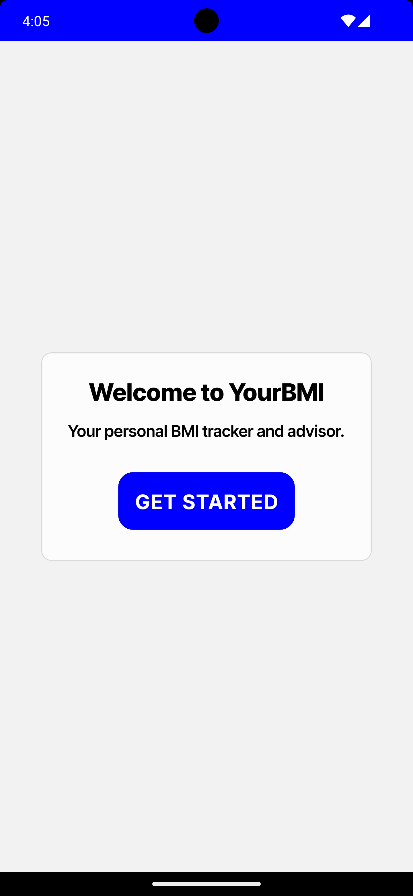
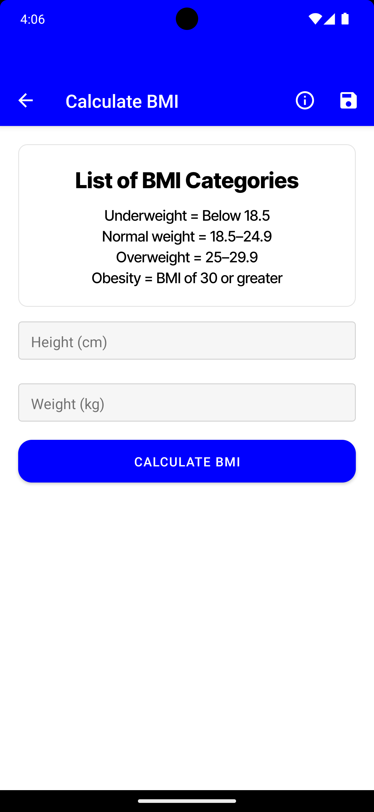
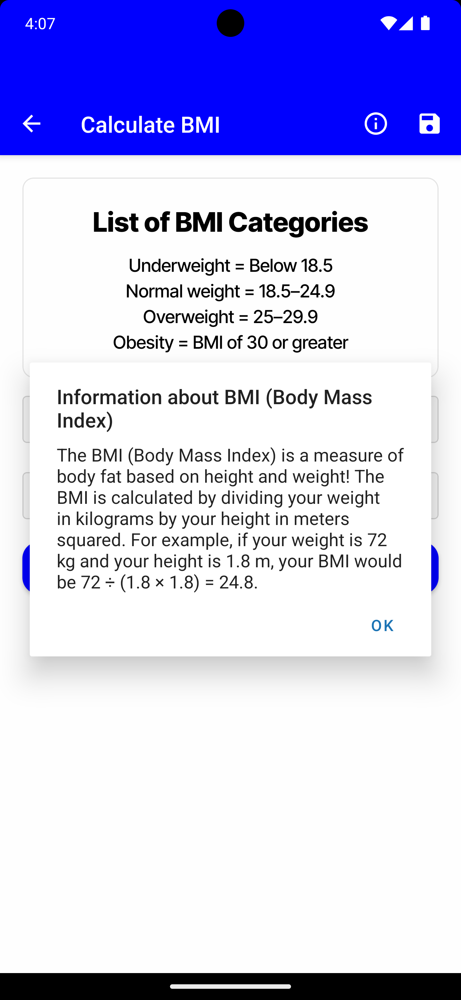
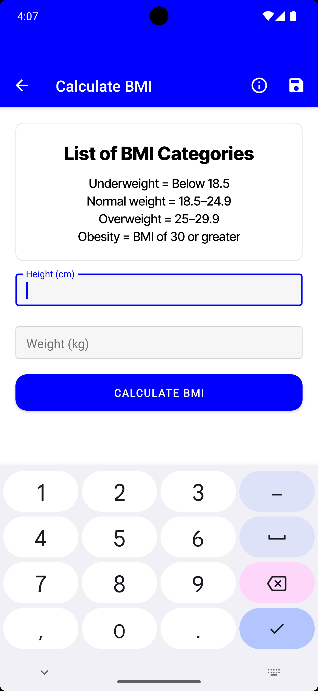
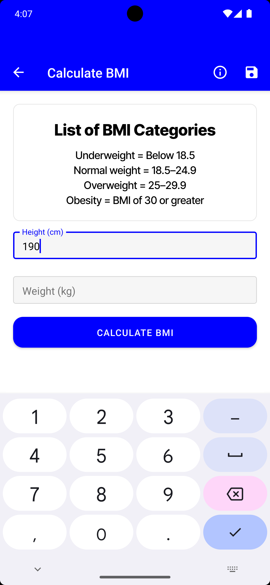
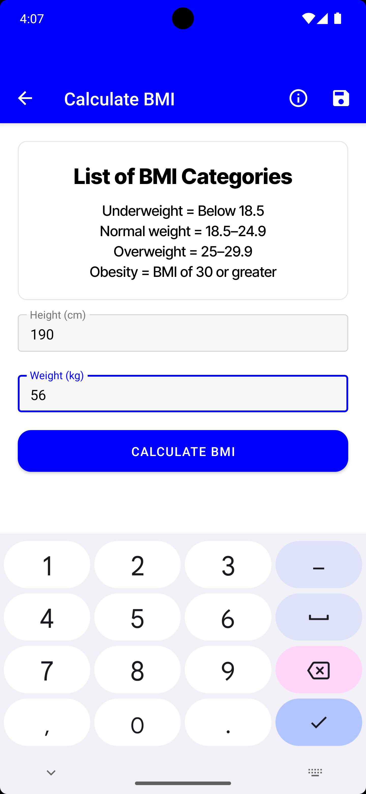
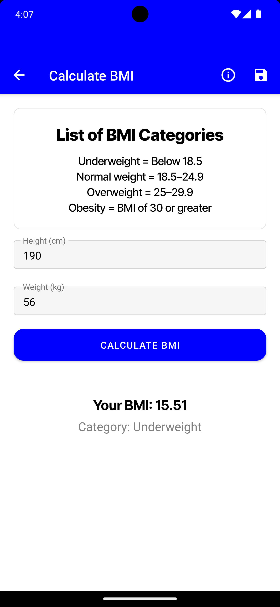

# React Native BMI Calculator App Documentation

## HomeScreen.js Documentation

### Overview
The `HomeScreen.js` is the core component where users interact to calculate their Body Mass Index (BMI). It plays a critical role in data input, calculation, and result presentation.

### User Interface
The layout includes user-friendly text input fields for height (in centimeters) and weight (in kilograms), a calculate button, and a display area for BMI results. The design focuses on simplicity and ease of use.

### Functionality

#### Input Handling
Inputs are managed using React's state management. Users can enter their height and weight, which are then processed for BMI calculation.

#### BMI Calculation
The BMI is calculated using the formula: weight (kg) / (height (m)²). This section includes the formula implementation and any considerations taken for unit conversions.

#### Error Handling
Error handling is crucial for user inputs. This section describes the validation rules (e.g., non-negative numbers, realistic human weight and height ranges) and how error messages are displayed to the user.

#### State Management
React's `useState` hook is used for handling user inputs, calculated BMI, and error messages. This ensures a responsive and interactive user experience.

#### Result Display
The calculated BMI is displayed along with its health category (e.g., underweight, normal, overweight). This section explains how the categorization is done based on BMI value.

#### Saving Results
Users can save their BMI results as an image in their device using the MediaLibrary API. This process, including permissions and file handling, is detailed here.

#### Styling and Design
This section covers the StyleSheet used in `HomeScreen.js`, discussing the design choices for layout, color schemes, and responsiveness.

## WelcomeScreen.js Documentation

### Introduction
`WelcomeScreen.js` serves as the first point of contact with the user, introducing them to the app.

### Layout and Design
The screen layout includes a welcome message and navigation options. The design aims to be inviting and straightforward, guiding users to start using the app.

### Navigation
Details on how `WelcomeScreen.js` links to `HomeScreen.js`, including any animations or transitions used.

### User Experience
This section focuses on the user experience aspects, such as ease of navigation, visual appeal, and any interactive elements.

### Code Structure
Explains the organization of the React components in `WelcomeScreen.js`, and how they work together to create a cohesive user interface.

## App.js Documentation

### Role of App.js
`App.js` acts as the entry point of the React Native app, setting up the overall framework and navigation.

### Navigation Setup
In-depth explanation of the React Navigation setup, including the creation of a stack navigator and the configuration of routes.

### Routing
Details on how routing is managed within the app, with emphasis on the initial route and how screen transitions are handled.

### Global Styles and Themes
Discusses any global styles or themes defined in `App.js` that are applied across the app for consistency in design.

### Performance Optimization
This section covers strategies and methods implemented to enhance the app's performance, such as optimizing render cycles and reducing memory usage.

<!-- Adding two images per row -->

#### Images of Application

 

 

 

 

## Installation

To get started with the React Native BMI Calculator app, follow these steps:

1. **Clone the Repository**
   ```
   git clone https://github.com/enisgjinii/YourBMI.git
   ```
   This command clones the app repository to your local machine.

2. **Navigate to the Project Directory**
   ```
   cd YourBMI
   ```
   Change to the app's root directory.

3. **Install Dependencies**
   ```
   npm install
   ```
   This installs all the necessary dependencies listed in the `package.json` file.

4. **Run the App**
   - For iOS:
     ```
     npx react-native run-ios
     ```
   - For Android:
     ```
     npx react-native run-android
     ```
   These commands will start the app on an iOS simulator or Android emulator, respectively.

Ensure you have React Native and its dependencies set up on your development machine. For more details, refer to the official [React Native Documentation](https://reactnative.dev/docs/environment-setup).


This installation guide is a standard approach for React Native apps and should be suitable for your project. Make sure to test these steps to confirm they work as expected with your specific app setup.