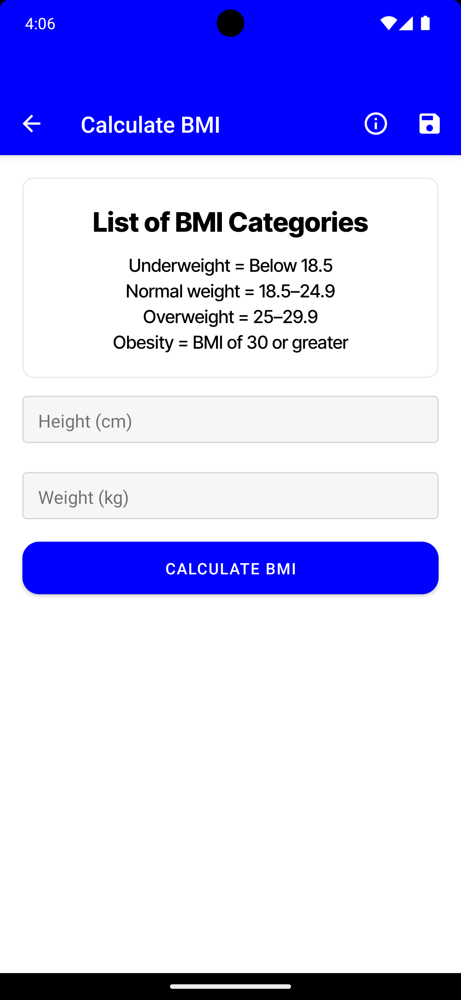

# HomeScreen.js

1. **Overview**: Introduction to HomeScreen, its role in BMI calculation.
2. **User Interface**: Detailed description of layout elements - text inputs, buttons, and result display.
3. **Functionality**:
   * Input Handling: How height and weight inputs are received and managed.
   * BMI Calculation: Explain the formula and calculation process.
   * Error Handling: Describe validation rules and error messages for incorrect inputs.
4. **State Management**: Discuss useState for handling input, BMI, and error states.
5. **Result Display**: Mechanism of displaying BMI and corresponding health category.
6. **Saving Results**: Detailed process of saving BMI results using MediaLibrary.
7. **Styling and Design**: Explain the StyleSheet and design choices.

<table data-view="cards"><thead><tr><th></th><th></th><th></th></tr></thead><tbody><tr><td></td><td></td><td></td></tr><tr><td></td><td></td><td></td></tr><tr><td></td><td></td><td></td></tr><tr><td></td><td></td><td></td></tr><tr><td></td><td></td><td></td></tr><tr><td></td><td></td><td></td></tr><tr><td></td><td></td><td></td></tr></tbody></table>

|   |   |
| - | - |
|   |   |
|   |   |
|   |   |

<figure><figcaption></figcaption></figure>
